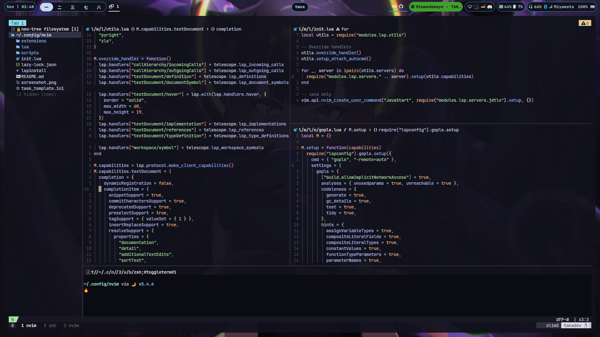

# My Neovim setup
## Table Of Content
<!-- vim-markdown-toc GFM -->
* [list of Plugins](#list-plugins) 
* [What I'm Planning to do in the Future](#todo)

## [Plugin's List]

## [todo](#todo)
- [x] Switch to lua
- [ ] Refactor config
  - [ ] Refactor LSP languange specific config
  - [ ] Refactor module (Plugin) specific config
- [ ] switch statusline diagnostic 
- [ ] add workspace wide diagnostic
- [ ] snippets
  - [ ] Markdown
  - [ ] dart
  - [ ] tex
  - [ ] Golang
