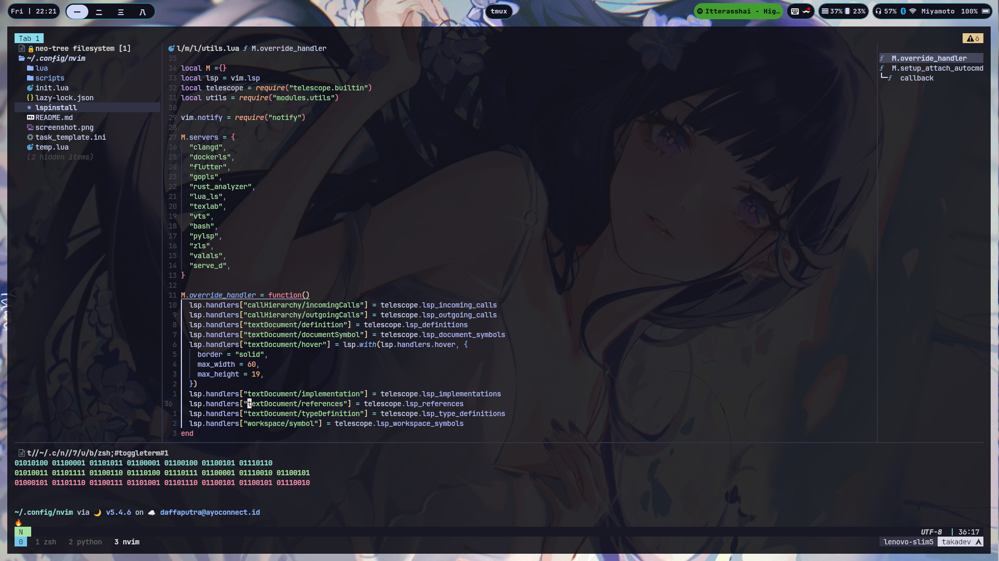

# My Neovim setup

> Always WIP

## Table Of Content

<!-- vim-markdown-toc GFM -->
* [What I'm Planning to do in the Future](#todo)

## [TODO](#todo)

* [ ] Refactor config based on [gleipnir's structure](https://github.com/nvimdev/dope) for better visibility
* [ ] Switch from deprecated's feline to lualine
* [ ] LSP
    * [ ] Try [Pylyzer](https://github.com/mtshiba/pylyzer) for python's lsp
