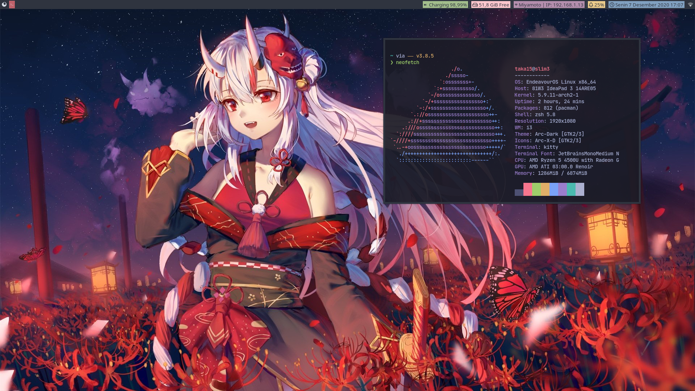
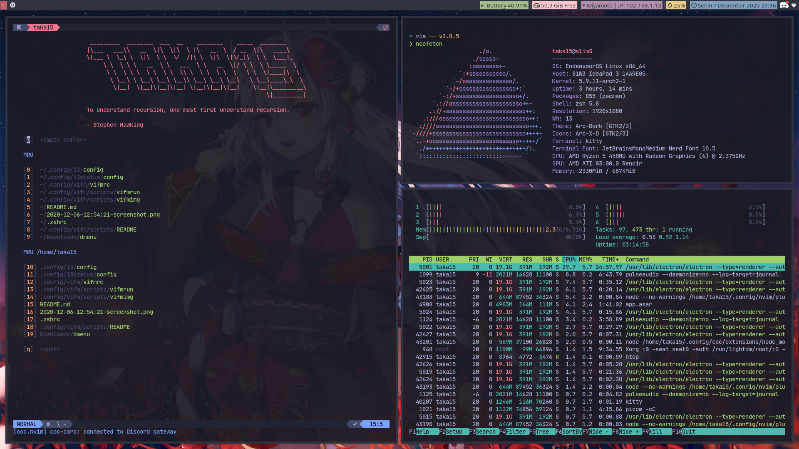

# Under construction

Thanks to [this](https://harfangk.github.io/2016/09/18/manage-dotfiles-with-a-git-bare-repository.html) i finally fix my dots.

 **switch to arch**

## Restoring
```  
alias -s dotfiles="/usr/bin/git --git-dir $HOME/.dotfiles/ --work-tree=$HOME"  
git clone --bare https://www.github.com/GeminorumB/dotfiles.git $HOME/.dotfiles  
dotfiles checkout  
dotfiles config --local status.showUntrackedFiles no
```

## Requirements
* [Jetbrains Mono Nerd font](https://github.com/ryanoasis/nerd-fonts/releases/download/v2.1.0/JetBrainsMono.zip)

## My Setup
* **Distro** : Arch
* **WM** : i3wm 
* **Theme** : [dracula](https://draculatheme.com/)
* **Shell** : zsh 
* **File Manager** : Vifm + Uberzurg
* **Terminal** : kitty + tmux 
* **Editor** : neovim 

## Screenshot




## TODO List
- [ ] Add jupyter plugin to vim
- [ ] make install script for dotfiles
- [ ] use zathura (maybe LoL)
- [x] switch to arch (important)
- [ ] vim debugging script 
