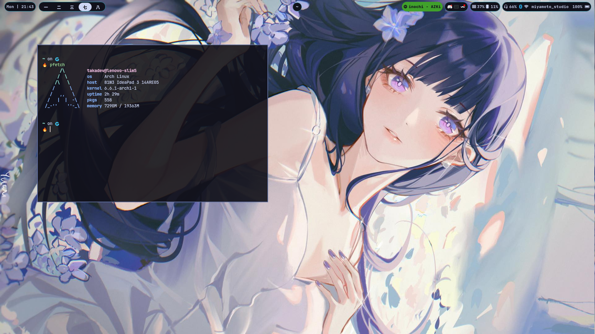

# Arch setup

## Installations

<details>
    <summary> Installations </summary>

```bash
alias dots="/usr/bin/git --git-dir $HOME/.dotfiles/ --work-tree=$HOME"  
git clone --bare https://www.github.com/takadev15/dotfiles.git $HOME/.dotfiles
dots checkout  
dots config --local status.showUntrackedFiles no
```

</details>

## My Setup

* **Distro** : Arch Linux
* **WM** : Sway
* **Status Bar** : Waybar
* **Theme** : Catpuccin Mocha with Papirus Dark Icon
* **Shell** : Zsh with Starship Prompt
* **File Manager** : Xplr, Ranger (TUI) Thunar (GUI)
* **Terminal** : Kitty, Foot + Tmux
* **Editor** : Neovim Nightly

## Screenshot

* ricing


## TODO List

* [x] Sway
  * [x] Switch greeter to tui greeter from sddm
  * [x] Fix swayidle
* [ ] Want to use nix or nixos
* [ ] Scripts
  * [ ] Bluetooth Menu scripts
  * [ ] Fix screenshot Menu scripts

## 注意！！

**if you want to copy my dotfiles please consider the software i use and plugis so the config can run smoothly**
