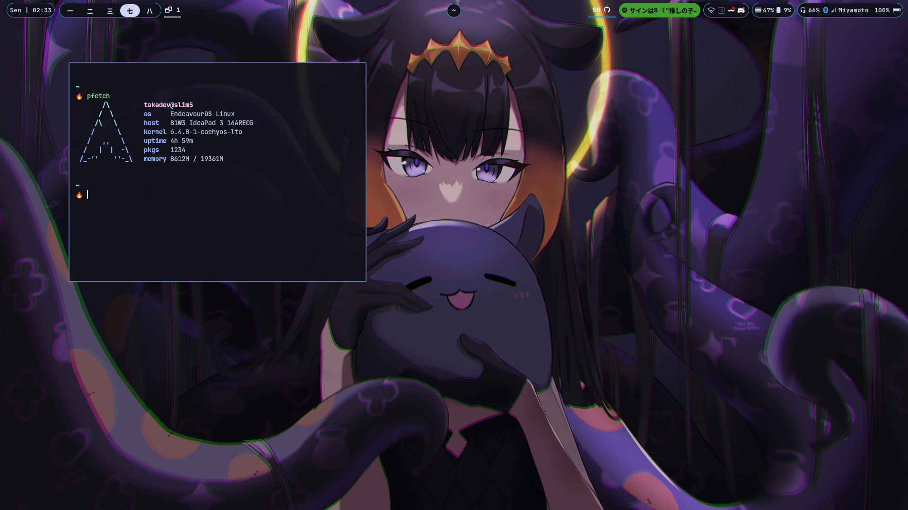

# Arch setup

## How to Download
jssjjsj

```sh  
alias dotfiles="/usr/bin/git --git-dir $HOME/.dotfiles/ --work-tree=$HOME"  
git clone --bare https://www.github.com/Takachii15/dotfiles.git $HOME/.dotfiles
dotfiles checkout  
dotfiles config --local status.showUntrackedFiles no
```

## My Setup

* **Distro** : Archlinux
* **WM** : i3wm with i3gaps
* **status bar** : Polybar
* **Theme** : Material
* **Shell** : zsh with starship prompt
* **File Manager** : vifm
* **Terminal** : kitty + tmux
* **Editor** : neovim v0.6.0dev

## Screenshot

* ricing


## TODO List

* [ ] Neovim
  * [ ] Refactor (98% done)
  * [ ] LSP Install script
  * [x] Switch to lua
* [ ] set neomutt
* [ ] Refactor zshrc
  * [x] aliasrc
  * [ ] env and else

## ATTENTION

**if you want to copy my dotfiles please consider the software i use and plugis so the config can run smoothly**
