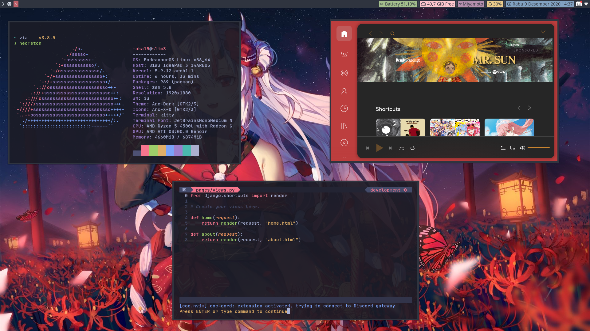

# Switching bar into polybar

Thanks to [this](https://harfangk.github.io/2016/09/18/manage-dotfiles-with-a-git-bare-repository.html) i finally fix my dots.

## Restoring
```  
alias dotfiles="/usr/bin/git --git-dir $HOME/.dotfiles/ --work-tree=$HOME"  
git clone --bare https://www.github.com/Takachii15/dotfiles.git $HOME/.dotfiles  
dotfiles checkout  
dotfiles config --local status.showUntrackedFiles no
```

## Requirements
* [Jetbrains Mono Nerd font](https://github.com/ryanoasis/nerd-fonts/releases/download/v2.1.0/JetBrainsMono.zip)

## My Setup
* **Distro** : Arch (endevouros)
* **WM** : i3wm with i3gaps
* **status bar** : Polybar 
* **Theme** : tokyo-night
* **Shell** : zsh with starship prompt
* **File Manager** : nnn
* **Terminal** : kitty/alacritty + tmux 
* **Editor** : neovim nightly 

``````
i use two terminal emulator because kitty seemingly doesn't support fcitx input method that i use
so i use alacritty specifically only for fcitx-mozc input (for my japanese study) 
for why i don't use ibus (that seemingly supported by kitty) because compare to ibus, fcitx is better
``````

## Screenshot
* ricing


* heavy workload


## TODO List
- [x] make install script for dotfiles
- [x] use zathura (maybe LoL)
- [x] switch to arch (important)
- [x] find a way to integrate fcitx-mozc into kitty input
- [ ] perfected my new polybar ricing
- [ ] change vim statusline rice
- [ ] make vim debugging script 
- [ ] Add jupyter plugin to vim
- [ ] perfect my dotfiles management
- [ ] make an Install script for all my config
- [ ] enable org-mode (or something similiar?) in vim

## ATTENTION ##
 **if you want to copy my dotfiles please consider the software i use and plugis so the config can run smoothly**
